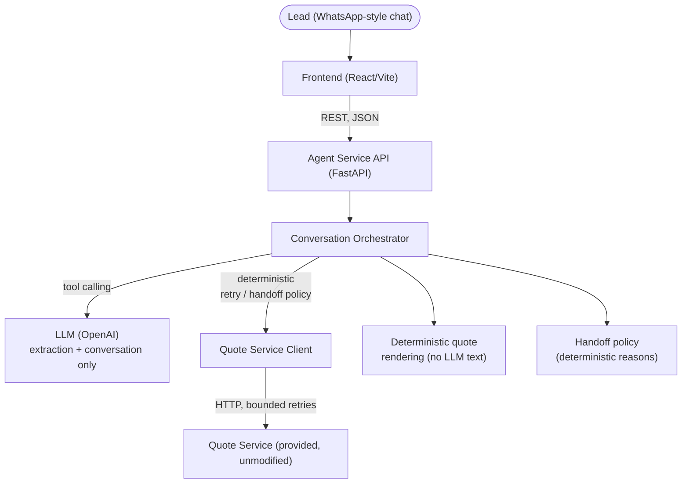

# AutoSeguro — Conversational Insurance Agent

A WhatsApp-style agent for a fictional car insurer: it converses with a lead,
qualifies them, requests a real quote from a deliberately unreliable backend
service, and either closes the deal or hands off to a human — with explicit
traceability and a structural guarantee that it never invents a price.

Built for the Namastex Forward Deployed Engineer take-home challenge (see
[`CHALLENGE.md`](./CHALLENGE.md) for the original brief, kept verbatim).

**Live demo:** not deployed — this is a local take-home submission. Run it
locally with the instructions below (`docker compose up --build` is the
fastest path).

---

## Architecture



The LLM is responsible for **understanding language, extracting structured
fields, and deciding when to call a tool.** It is never responsible for
business rules, price calculation, retries, application state, or
validation — those all live in typed, deterministic Python, and are
independently tested against the real `quote-service`, not a mock of it.

## Repository structure

```text
namastex-fde-challenge/
├── CHALLENGE.md              # original brief, unmodified
├── README.md                 # this file
├── docker-compose.yml        # brings up the whole stack
├── quote-service/            # provided mock quote API — unmodified
├── dataset/                  # provided synthetic conversation dataset
├── docs/                     # dataset-analysis.md — offline eval source, not runtime
├── agent-service/            # the agent itself (this challenge's core deliverable)
│   ├── app/                  # api / agent / domain / integrations / observability / config
│   ├── tests/                # unit (incl. dataset-eval fixture), integration (real quote-service), e2e
│   ├── docs/                 # real conversation logs (see below)
│   └── README.md             # backend-specific run instructions + full decision log
├── frontend/                 # WhatsApp-style demo UI (optional, not the primary evaluation criterion)
│   └── src/demo/             # offline, backend-free UI demo — NOT production, see its README
└── .ai/                      # AI-assisted development process (agents, prompts, workflows, reviews)
```

## Prerequisites

- [Docker](https://www.docker.com/) + Docker Compose (recommended path), **or**
- Python 3.12+ with [uv](https://docs.astral.sh/uv/), and Node.js 20+ with npm (manual path)
- An OpenAI API key (for the agent's LLM calls)

## Environment variables

Copy the example files and fill in the one real secret:

```bash
cp agent-service/.env.example agent-service/.env
# edit agent-service/.env and set OPENAI_API_KEY
```

`agent-service/.env.example` documents every variable (LLM provider/model/key,
quote-service timeouts and retry policy, CORS origins, behavior bounds).
`frontend/.env.example` documents `VITE_AGENT_SERVICE_URL` (not sensitive —
just where to reach the backend). **No `OPENAI_API_KEY` or equivalent is ever
read by the frontend** — it only talks to `agent-service`, never to OpenAI
directly.

## Running the full stack

### Docker Compose (recommended)

```bash
docker compose up --build
```

This starts, in dependency order with real health checks (not arbitrary
sleeps):

| Service | URL | Notes |
|---|---|---|
| `quote-api` | http://localhost:8000 | provided, unmodified |
| `agent-service` | http://localhost:8080 | waits for `quote-api` to be healthy |
| `frontend` | http://localhost:5173 | waits for `agent-service` to be healthy |

API docs (interactive OpenAPI/Swagger UI, auto-generated by FastAPI):
**http://localhost:8080/docs**

### Manual, multi-terminal (fallback)

```bash
# terminal 1 — quote-service
cd quote-service && uv run uvicorn app.main:app --port 8000

# terminal 2 — agent-service
cd agent-service && cp .env.example .env   # set OPENAI_API_KEY
uv sync && uv run uvicorn app.main:app --reload --port 8080

# terminal 3 — frontend
cd frontend && npm install && npm run dev
```

### Tests

```bash
# backend — 133 tests: unit (no external deps) + integration (spins up the
# real quote-service itself) + e2e (real FastAPI app + fake LLM)
cd agent-service && uv run pytest

# frontend
cd frontend && npm run lint && npm run typecheck && npm run test -- --run && npm run build
```

### One complete conversation

[`agent-service/docs/conversation-log.md`](./agent-service/docs/conversation-log.md)
is a real, complete conversation — real OpenAI LLM, real `quote-service` —
from greeting to a resolved quote. A second real run,
[`conversation-log-resilience-example.md`](./agent-service/docs/conversation-log-resilience-example.md),
is kept because it organically hit a transient failure and a slow-but-successful
call during the same demo session — unscripted evidence of the exact
scenario this project weights most heavily.

---

## Key engineering decisions, and why

**LLM-driven, but conversation state is not LLM memory.** The model drives
natural-language understanding and extraction; `LeadProfile`,
`ConversationStatus`, retry counts, and handoff triggers are explicit
application state tracked by the orchestrator in Python. Every decision that
matters — ask again, give up on a field, retry a quote, hand off — is
deterministic, not "hopefully the prompt handles it."

**The price the lead sees is never LLM-generated text.** `get_quote`
arguments are rejected if they don't exactly match the already-confirmed
profile (guards against the model inventing or silently changing a value on
the one tool call that reaches an external system). On success, the message
and structured summary are built by a deterministic template directly from
the typed response `quote-service` returned — the model never authors that
text. A regex safety net additionally catches stray price mentions
(`R$`, `BRL`, `reais`, `/mês`, `por mês`, `mensalidade de`) in any plain-text
reply outside a successful quote, without flagging ordinary numbers like
vehicle years, ages, CEPs, or trace ids. This is the belt-and-suspenders
layer — the real guarantee is structural.

**One deliberate, narrow deviation from generic retry guidance**: `http_500`
is treated as transient here, alongside 502/503/504 — but only when the
response body is this specific service's known `{"error":
"upstream_unavailable"}` envelope. Direct inspection of
`quote-service/app/main.py` shows this specific service emits 500/502/503
from the identical simulated-instability branch, with that same envelope —
for this dependency, 500 isn't a distinct failure mode. Treating it as
unconditionally non-retryable would silently drop retry coverage for
roughly a third of all simulated infra failures, directly undermining the
challenge's most heavily weighted criterion; treating *every* 500 as
retryable regardless of body would risk silently retrying against an
unrelated or malformed failure it doesn't actually understand — an
unrelated 500 is classified `invalid_response_contract` and is terminal,
not retried. See `agent-service/app/domain/policies/retry_policy.py` for
the full classification table,
`agent-service/tests/unit/test_retry_policy.py` for the classifier-level
proof of both sides, and
`agent-service/tests/integration/test_quote_service_client.py` for tests
that force both the retryable path against the real service and the
non-retryable malformed-body path.

**The read timeout (15s) is set deliberately above quote-service's simulated
slow-response duration (8s default)** — a naive short timeout would
misclassify a slow-but-successful call as a failure, exactly the trap the
brief calls out by name. Proven both by a dedicated test and by an organic,
unscripted occurrence during the live demo (see the resilience-example log
above).

**Handoff reasons are a fixed, machine-readable enum**, each mapped to a
templated (never LLM-generated) user-facing message and a redacted
conversation summary — now exposed via `GET /conversations/{id}`
(`handoff.summary`) so a human operator has enough context to continue
without re-asking the lead everything. Every handoff is triggered by a
countable, deterministic condition (attempt counts, HTTP status, tool-loop
iteration bound, consecutive LLM-call failures), deliberately *not* an LLM
self-reported confidence score — that itself would be an unaccountable
judgment call.

**CEP is soft-required by contract, not by oversight.** `quote-service`
itself treats a missing CEP as valid (region multiplier defaults to 1.0,
not a refusal), so the agent has no correctness reason to be stricter than
the system it's quoting against. Proven against the real service by
`tests/unit/test_cep_and_start_date_contract.py`.

**`data_inicio` is not an LLM-settable input.** It drives `quote-service`'s
pro-rata first-payment math, and unlike `veiculo_ano`/`idade`/`plano_id`/
`cep` there is no extraction step or `LeadProfile` field to hold a
confirmed value for it — so the agent never asks for it and `get_quote`'s
tool spec has no `data_inicio` parameter for the model to fill in. Even a
non-conformant tool call that includes one is silently dropped before it
reaches `quote-service`, closing off a channel for the model to pick the
price shown to the lead. Proven by
`tests/unit/test_cep_and_start_date_contract.py::test_llm_supplied_data_inicio_never_reaches_the_quote_request`.
The `QuoteRequestPayload`/`data_inicio` wire contract itself still exists
and is exercised directly (bypassing the LLM) by
`tests/integration/test_quote_service_client.py`, since `quote-service`
does support the field.

**Two tools, no MCP.** `record_lead_info` (pure extraction, touches nothing
external) and `get_quote` (the only tool reaching `quote-service`, and only
after the arg-match guard above). A full MCP server for one internal tool
would be infrastructure this challenge doesn't need.

**LLM provider is swappable in principle, minimal in practice.** One
`LLMClient` Protocol, one `OpenAIChatClient` implementation, one factory
keyed off `LLM_PROVIDER`/`LLM_MODEL`/`OPENAI_API_KEY`. Adding another
provider later means one new file and one new branch — no change to
orchestration, retry policy, handoff policy, or observability.

**In-memory conversation storage — an explicit, scoped limitation.**
`ConversationRepository` is a Protocol; the only implementation is in-memory.
State is lost on restart and isn't safe across multiple worker processes.
Swapping in Redis/Postgres later means implementing the Protocol — nothing
else changes.

## Explicitly rejected technologies, and why

None of the following were added, because nothing in the actual challenge
requirements demonstrated a concrete need for them:

- **MCP** — one internal tool (`get_quote`) doesn't justify a protocol server.
- **RAG / vector databases** — there's no unstructured knowledge base to
  retrieve from; the dataset provided is conversational examples, not a
  document corpus, and business rules come from one small, fully-typed
  `GET /planos` response.
- **Event buses / queues** — the whole flow is synchronous
  request/response; there's no fan-out or async workload that would justify one.
  Microservices / CQRS / Kubernetes — massive overkill for a single agent
  service fronting one downstream dependency.
- **A generic multi-provider LLM framework** — one Protocol, one
  implementation, one factory is enough for "provider-agnostic" here; a
  framework would be solving a problem this project doesn't have yet.

## AI-assisted development methodology

This repo was built with Claude Code, using a structured process (`.ai/`)
rather than ad hoc prompting:

- **`.ai/agents/backend-dev.yaml`** — a written specification of engineering
  principles, decision policies (exact retryable/non-retryable failure
  classes, handoff reason taxonomy), constraints, and a definition of done,
  used as the standing brief for all backend work.
- **`.ai/workflows/*.workflow.md`** — a three-stage process per feature area
  (implement → review → validate), each stage with its own required inputs,
  steps, and output format.
- **`.ai/project/context.md` / `architecture.md`** — living documents of
  what's actually true about the project (stack, structure, conventions),
  kept in sync with the code rather than written once and left stale.
- **`.ai/project/reviews/`** — the actual, independent review and validation
  passes run against this codebase before submission (not just written as
  theory): `final-backend-review.md` and `final-validation-report.md`.

The point of this structure wasn't process for its own sake: several
concrete decisions above (the `http_500` deviation, the CEP/`data_inicio`
contract, the handoff reason taxonomy) trace directly back to principles
written in `backend-dev.yaml` before implementation started, and the
final review pass caught and fixed real issues (see the review report)
rather than rubber-stamping already-written code.

## Failure and retry behavior

`quote-service` calls: explicit connect (3s) and read (15s) timeouts, max 3
attempts, exponential backoff with jitter. Retryable: connection errors,
timeouts, and HTTP 500/502/503/504 (with the documented 500 deviation
above). Never retried: `422 cotacao_recusada` (a legitimate business
refusal — relayed to the lead as the reason, then handoff) and `400
payload_invalido` (the agent's own bug — technical handoff). Exhausting all
retries on a transient failure never fabricates a quote; it always hands
off with reason `quote_service_unavailable_after_retries`.

## Handoff behavior

Nine fixed reasons across two categories (technical/business — see
`agent-service/app/domain/models.py`), each producing a templated user
message and a redacted operator summary. Business reasons: lead explicitly
asks for a human, quote-service refuses on eligibility grounds, a required
field can't be confirmed after 2 attempts, the tool-loop exceeds its bound
(4 iterations) without resolving, or the topic is out of scope. Technical
reasons: retries exhausted, an invalid response contract from
quote-service, an unrecoverable integration failure (e.g. two consecutive
LLM-call failures), or internal state inconsistency (e.g. the model trying
to submit a quote with tampered arguments twice in a row).

## Observability and traceability

Every conversation, message, quote attempt, and handoff carries an id:
`conversation_id`, `request_id` (per HTTP call, propagated via
`X-Request-Id`), `quote_request_id` (per logical quote attempt group,
shared across retries), `quote_id` (minted locally only on success —
`quote-service` itself issues none), `handoff_id`. `GET
/conversations/{id}/quote-attempts` exposes the full per-attempt trace
(status, HTTP status, error class, latency) for any conversation.
Structured JSON logs (structlog) record every quote attempt, retry
schedule, LLM call outcome, and handoff — all correlatable by these ids.

## Privacy and PII handling

The raw lead message body is **never logged at all** — only
`conversation_id`, `message_type`, and character length. Anything that does
get written down (a handoff summary quoting the lead's own words) is
scrubbed of CPF/phone/email/plate patterns first (`redact_pii`); CEP is
truncated to its 2-digit region prefix (`redact_cep`) everywhere it's
exposed for observability or handed to a human operator — in logs and in
the human-handoff summary's own qualification-data line — while the full
CEP is retained in operational state (`LeadProfile`, the quote request),
since quoting legitimately needs it. An end-to-end test captures real log
output and asserts a volunteered CPF/phone never appears in it;
`agent-service/tests/unit/test_handoff_policy.py` asserts the same for the
full CEP in a handoff summary.
The synthetic dataset (`dataset/`) is not read at runtime by the agent at
all — zero risk of it leaking into a live conversation or a log line.

## Limitations

- **In-memory storage only** — state is lost on restart, not safe across
  multiple worker processes. Acceptable for this challenge, not for
  production.
- **No authentication or rate-limiting** on the API — out of scope per the
  brief; required before any real deployment.
- **Single quote-service base URL, no service discovery** — fine for a
  local/demo deployment.
- **The `get_quote` argument-mismatch guard is scoped to a single HTTP
  request's tool-calling loop**, not the conversation's whole lifetime — a
  model that mismatches once per turn across many separate turns wouldn't
  trip the "twice in a row" safety net. Narrow and understood, not closed.
- **The dataset is used only as an offline evaluation source, not at
  runtime.** [`docs/dataset-analysis.md`](./docs/dataset-analysis.md)
  documents the patterns found in `dataset/conversations.parquet`
  (informal Portuguese, incomplete/multi-field messages, volunteered
  PII-shaped text, ambiguous vehicle descriptions, objections, media
  markers) and the sanitized, handcrafted fixture
  (`agent-service/tests/fixtures/offline_dataset_eval_cases.json`) derived
  from them, checked by
  `agent-service/tests/unit/test_offline_dataset_eval_cases.py`. No
  production code reads the dataset or the fixture at runtime — it exists
  purely to keep the extraction/guard/handoff logic honest against
  realistic phrasing, not as RAG or a prompt store.
- **No gated live-LLM regression test** in the suite yet — the one real
  demo run is manual, not part of CI.
- Frontend is intentionally a secondary concern — a real WhatsApp
  integration, auth, and multi-tenant support are all out of scope.

## Production-hardening considerations

Before this could run for real traffic: replace in-memory storage with
Redis/Postgres behind the existing `ConversationRepository` Protocol (no
orchestration changes needed); add authentication and per-lead rate
limiting; add a gated live-LLM contract test to catch SDK/schema drift in
CI; consider structured cost/latency budgets per LLM call; add
multi-instance-safe locking (the current per-conversation `asyncio.Lock` is
single-process only); wire real secrets management instead of `.env` files;
add horizontal scaling behind a load balancer once state is externalized.
