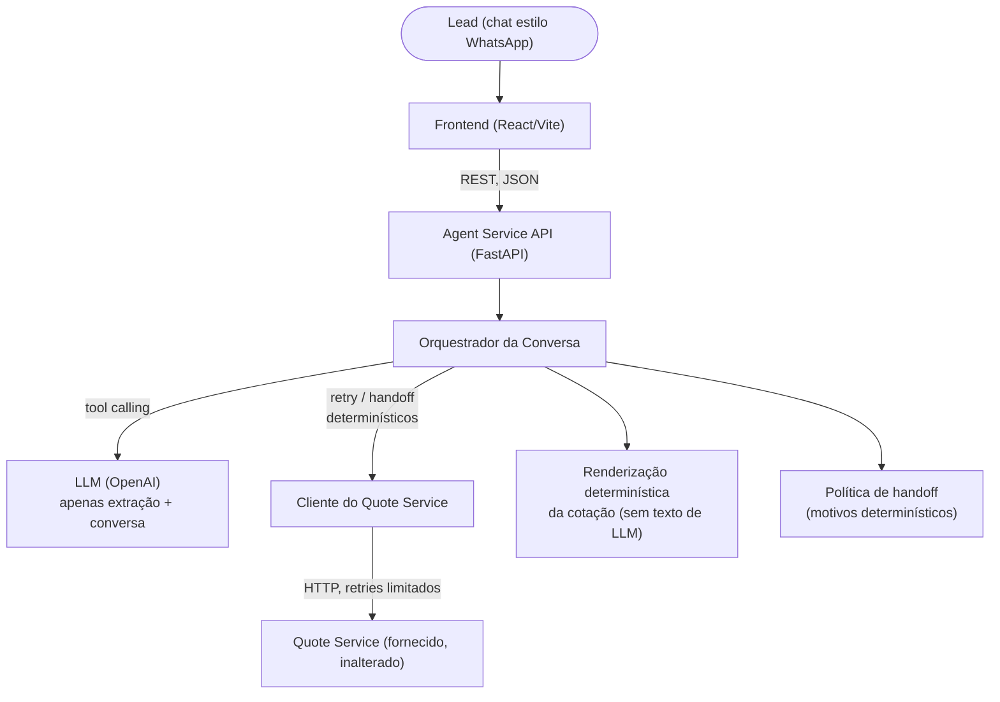

# AutoSeguro — Agente Conversacional de Seguros

*[Read this in English](./README.md)*

Um agente estilo WhatsApp para uma seguradora de veículos fictícia: ele
conversa com um lead, qualifica-o, solicita uma cotação real a um serviço de
backend deliberadamente instável, e ou fecha a venda ou transfere para um
humano — com rastreabilidade explícita e uma garantia estrutural de que
nunca inventa um preço.

Construído para o desafio Forward Deployed Engineer (take-home) da Namastex
(veja [`CHALLENGE.md`](./CHALLENGE.md) para o brief original, mantido
literal).

**Demo ao vivo:** não implantado — esta é uma submissão local de take-home.
Execute localmente com as instruções abaixo (`docker compose up --build` é o
caminho mais rápido).

---

## Arquitetura



O LLM é responsável por **entender linguagem natural, extrair campos
estruturados e decidir quando chamar uma ferramenta.** Ele nunca é
responsável por regras de negócio, cálculo de preço, retries, estado da
aplicação ou validação — tudo isso vive em Python tipado e determinístico, e
é testado de forma independente contra o `quote-service` real, não um mock
dele.

## Estrutura do repositório

```text
namastex-fde-challenge/
├── CHALLENGE.md              # brief original, inalterado
├── README.md                 # versão em inglês
├── README.pt-BR.md           # este arquivo
├── docker-compose.yml        # sobe a stack completa
├── quote-service/            # API de cotação mock fornecida — inalterada
├── dataset/                  # dataset sintético de conversas fornecido
├── docs/                     # dataset-analysis.md — fonte de avaliação offline, não é usado em runtime
├── agent-service/            # o agente em si (entrega principal deste desafio)
│   ├── app/                  # api / agent / domain / integrations / observability / config
│   ├── tests/                # unit (inclui fixture de avaliação do dataset), integration (quote-service real), e2e
│   ├── docs/                 # logs de conversas reais (veja abaixo)
│   └── README.md             # instruções específicas do backend + histórico completo de decisões
├── frontend/                 # UI de demo estilo WhatsApp (opcional, não é o critério principal de avaliação)
│   └── src/demo/             # demo de UI offline, sem backend — NÃO é produção, veja seu README
└── .ai/                      # processo de desenvolvimento assistido por IA (agentes, prompts, workflows, reviews)
```

## Pré-requisitos

- [Docker](https://www.docker.com/) + Docker Compose (caminho recomendado), **ou**
- Python 3.12+ com [uv](https://docs.astral.sh/uv/), e Node.js 20+ com npm (caminho manual)
- Uma chave de API da OpenAI (para as chamadas de LLM do agente)

## Variáveis de ambiente

Copie os arquivos de exemplo e preencha o único segredo real:

```bash
cp agent-service/.env.example agent-service/.env
# edite agent-service/.env e defina OPENAI_API_KEY
```

`agent-service/.env.example` documenta todas as variáveis (provedor/modelo/
chave do LLM, timeouts e política de retry do quote-service, origens CORS,
limites de comportamento). `frontend/.env.example` documenta
`VITE_AGENT_SERVICE_URL` (não é sensível — apenas onde encontrar o backend).
**Nenhuma `OPENAI_API_KEY` ou equivalente é jamais lida pelo frontend** —
ele só conversa com o `agent-service`, nunca diretamente com a OpenAI.

## Executando a stack completa

### Docker Compose (recomendado)

Garanta que o Docker Desktop (ou seu daemon Docker) esteja rodando antes —
sem isso, `docker compose up` falha imediatamente com um erro de conexão.

```bash
docker compose up --build
```

Isso inicia, em ordem de dependência com health checks reais (não `sleep`
arbitrário):

| Serviço | URL | Observações |
|---|---|---|
| `quote-api` | http://localhost:8000 | fornecido, inalterado |
| `agent-service` | http://localhost:8080 | aguarda `quote-api` ficar saudável |
| `frontend` | http://localhost:5173 | aguarda `agent-service` ficar saudável |

Documentação da API (Swagger UI interativo, gerado automaticamente pelo
FastAPI): **http://localhost:8080/docs**

### Manual, múltiplos terminais (alternativa)

```bash
# terminal 1 — quote-service
cd quote-service && uv run uvicorn app.main:app --port 8000

# terminal 2 — agent-service
cd agent-service && cp .env.example .env   # defina OPENAI_API_KEY
uv sync && uv run uvicorn app.main:app --reload --port 8080

# terminal 3 — frontend
cd frontend && npm install && npm run dev
```

### Testes

```bash
# backend — 133 testes: unit (sem dependências externas) + integration (sobe
# o quote-service real) + e2e (app FastAPI real + LLM fake)
cd agent-service && uv run pytest

# frontend
cd frontend && npm run lint && npm run typecheck && npm run test -- --run && npm run build
```

### Uma conversa completa

[`agent-service/docs/conversation-log.md`](./agent-service/docs/conversation-log.md)
é uma conversa real e completa — LLM real da OpenAI, `quote-service` real —
da saudação até uma cotação resolvida. Uma segunda execução real,
[`conversation-log-resilience-example.md`](./agent-service/docs/conversation-log-resilience-example.md),
foi mantida porque organicamente encontrou uma falha transitória e uma
chamada lenta-mas-bem-sucedida durante a mesma sessão de demo — evidência
não roteirizada exatamente do cenário que este projeto mais valoriza.

---

## Principais decisões de engenharia, e por quê

**Guiado por LLM, mas o estado da conversa não é memória do LLM.** O modelo
conduz o entendimento de linguagem natural e a extração; `LeadProfile`,
`ConversationStatus`, contagens de retry e gatilhos de handoff são estado
explícito da aplicação, rastreado pelo orquestrador em Python. Toda decisão
que importa — perguntar de novo, desistir de um campo, tentar cotação
novamente, transferir para humano — é determinística, não "espero que o
prompt resolva".

**O preço que o lead vê nunca é texto gerado por LLM.** Os argumentos de
`get_quote` são rejeitados se não corresponderem exatamente ao perfil já
confirmado (proteção contra o modelo inventar ou alterar silenciosamente um
valor na única chamada de ferramenta que alcança um sistema externo). Em
caso de sucesso, a mensagem e o resumo estruturado são construídos por um
template determinístico diretamente a partir da resposta tipada que o
`quote-service` retornou — o modelo nunca escreve esse texto. Uma rede de
segurança via regex adicionalmente captura menções avulsas de preço
(`R$`, `BRL`, `reais`, `/mês`, `por mês`, `mensalidade de`) em qualquer
resposta em texto livre fora de uma cotação bem-sucedida, sem sinalizar
números comuns como ano do veículo, idade, CEP ou ids de rastreamento. Essa
é a camada de cinto-e-suspensórios — a garantia real é estrutural.

**Um desvio deliberado e restrito da orientação genérica de retry**:
`http_500` é tratado como transitório aqui, junto com 502/503/504 — mas
apenas quando o corpo da resposta é o envelope conhecido e específico deste
serviço, `{"error": "upstream_unavailable"}`. A inspeção direta de
`quote-service/app/main.py` mostra que este serviço específico emite
500/502/503 a partir do mesmo branch de instabilidade simulada, com o
mesmo envelope — para esta dependência, 500 não é um modo de falha distinto.
Tratá-lo como incondicionalmente não-retentável descartaria silenciosamente
a cobertura de retry para cerca de um terço de todas as falhas de infra
simuladas, prejudicando diretamente o critério mais valorizado do desafio;
tratar *qualquer* 500 como retentável independentemente do corpo arriscaria
retry silencioso contra uma falha não relacionada ou malformada que ele não
entende de verdade — um 500 não relacionado é classificado como
`invalid_response_contract` e é terminal, não retentado. Veja
`agent-service/app/domain/policies/retry_policy.py` para a tabela completa
de classificação, `agent-service/tests/unit/test_retry_policy.py` para a
prova em nível de classificador de ambos os lados, e
`agent-service/tests/integration/test_quote_service_client.py` para testes
que forçam tanto o caminho retentável contra o serviço real quanto o
caminho não-retentável de corpo malformado.

**O timeout de leitura (15s) é definido deliberadamente acima da duração de
resposta lenta simulada do quote-service (8s padrão)** — um timeout curto
ingênuo classificaria erroneamente uma chamada lenta-mas-bem-sucedida como
falha, exatamente a armadilha citada nominalmente pelo brief. Comprovado
tanto por um teste dedicado quanto por uma ocorrência orgânica e não
roteirizada durante a demo ao vivo (veja o log do exemplo de resiliência
acima).

**Motivos de handoff são um enum fixo e legível por máquina**, cada um
mapeado para uma mensagem template (nunca gerada por LLM) voltada ao usuário
e um resumo de conversa redigido — agora exposto via
`GET /conversations/{id}` (`handoff.summary`) para que um operador humano
tenha contexto suficiente para continuar sem reperguntar tudo ao lead. Todo
handoff é disparado por uma condição contável e determinística (contagens de
tentativa, status HTTP, limite de iteração do loop de ferramentas, falhas
consecutivas de chamada ao LLM), deliberadamente *não* um score de confiança
autorreportado pelo LLM — isso por si só seria um julgamento
não-responsabilizável.

**CEP é soft-required por contrato, não por descuido.** O próprio
`quote-service` trata um CEP ausente como válido (o multiplicador regional
assume 1.0, não uma recusa), então o agente não tem motivo de correção para
ser mais rígido que o sistema que está cotando. Comprovado contra o serviço
real por `tests/unit/test_cep_and_start_date_contract.py`.

**`data_inicio` não é um input configurável pelo LLM.** Ele conduz o cálculo
pro-rata do primeiro pagamento do `quote-service`, e diferente de
`veiculo_ano`/`idade`/`plano_id`/`cep` não há etapa de extração nem campo em
`LeadProfile` para guardar um valor confirmado dele — então o agente nunca
pergunta por isso e a especificação da ferramenta `get_quote` não tem
parâmetro `data_inicio` para o modelo preencher. Mesmo uma chamada de
ferramenta não conforme que inclua um é silenciosamente descartada antes de
chegar ao `quote-service`, fechando um canal para o modelo escolher o preço
mostrado ao lead. Comprovado por
`tests/unit/test_cep_and_start_date_contract.py::test_llm_supplied_data_inicio_never_reaches_the_quote_request`.
O contrato de wire `QuoteRequestPayload`/`data_inicio` em si ainda existe e
é exercitado diretamente (contornando o LLM) por
`tests/integration/test_quote_service_client.py`, já que o `quote-service`
de fato suporta o campo.

**Duas ferramentas, sem MCP.** `record_lead_info` (extração pura, não toca
nada externo) e `get_quote` (a única ferramenta que alcança o
`quote-service`, e só depois da proteção de correspondência de argumentos
acima). Um servidor MCP completo para uma ferramenta interna seria
infraestrutura que este desafio não precisa.

**Provedor de LLM é trocável em princípio, mínimo na prática.** Um Protocol
`LLMClient`, uma implementação `OpenAIChatClient`, uma factory chaveada por
`LLM_PROVIDER`/`LLM_MODEL`/`OPENAI_API_KEY`. Adicionar outro provedor depois
significa um novo arquivo e um novo branch — sem mudança na orquestração,
política de retry, política de handoff ou observabilidade.

**Armazenamento de conversa em memória — uma limitação explícita e
delimitada.** `ConversationRepository` é um Protocol; a única implementação
é em memória. O estado é perdido no restart e não é seguro entre múltiplos
processos worker. Trocar por Redis/Postgres depois significa implementar o
Protocol — nada mais muda.

## Tecnologias explicitamente rejeitadas, e por quê

Nenhuma das seguintes foi adicionada, porque nada nos requisitos reais do
desafio demonstrou uma necessidade concreta para elas:

- **MCP** — uma única ferramenta interna (`get_quote`) não justifica um
  servidor de protocolo.
- **RAG / bancos de dados vetoriais** — não há base de conhecimento não
  estruturado para recuperar; o dataset fornecido é exemplos conversacionais,
  não um corpus de documentos, e as regras de negócio vêm de uma resposta
  `GET /planos` pequena e totalmente tipada.
- **Filas / barramentos de eventos** — todo o fluxo é síncrono
  requisição/resposta; não há fan-out ou carga de trabalho assíncrona que
  justificasse um.
  Microsserviços / CQRS / Kubernetes — overkill absurdo para um único
  serviço de agente à frente de uma dependência downstream.
- **Um framework genérico multi-provedor de LLM** — um Protocol, uma
  implementação, uma factory já bastam para "agnóstico de provedor" aqui;
  um framework estaria resolvendo um problema que este projeto ainda não
  tem.

## Metodologia de desenvolvimento assistido por IA

Este repositório foi construído com Claude Code, usando um processo
estruturado (`.ai/`) em vez de prompting ad hoc:

- **`.ai/agents/backend-dev.yaml`** — uma especificação escrita de
  princípios de engenharia, políticas de decisão (classes exatas de falha
  retentável/não-retentável, taxonomia de motivos de handoff), restrições e
  uma definição de pronto, usada como briefing permanente para todo o
  trabalho de backend.
- **`.ai/workflows/*.workflow.md`** — um processo de três estágios por área
  de funcionalidade (implementar → revisar → validar), cada estágio com
  seus próprios inputs obrigatórios, passos e formato de saída.
- **`.ai/project/context.md` / `architecture.md`** — documentos vivos sobre
  o que é de fato verdade sobre o projeto (stack, estrutura, convenções),
  mantidos sincronizados com o código em vez de escritos uma vez e deixados
  desatualizados.
- **`.ai/project/reviews/`** — as passagens reais e independentes de review
  e validação executadas contra este código antes da submissão (não apenas
  escritas como teoria): `final-backend-review.md` e
  `final-validation-report.md`.

O objetivo dessa estrutura não foi processo pelo processo: várias decisões
concretas acima (o desvio do `http_500`, o contrato de CEP/`data_inicio`, a
taxonomia de motivos de handoff) remontam diretamente a princípios escritos
em `backend-dev.yaml` antes de a implementação começar, e a passagem final
de review encontrou e corrigiu problemas reais (veja o relatório de review)
em vez de apenas validar código já escrito.

## Comportamento de falha e retry

Chamadas ao `quote-service`: timeouts explícitos de conexão (3s) e leitura
(15s), máximo de 3 tentativas, backoff exponencial com jitter. Retentável:
erros de conexão, timeouts e HTTP 500/502/503/504 (com o desvio documentado
do 500 acima). Nunca retentado: `422 cotacao_recusada` (uma recusa
legítima de negócio — repassada ao lead como o motivo, depois handoff) e
`400 payload_invalido` (bug do próprio agente — handoff técnico). Esgotar
todas as tentativas em uma falha transitória nunca fabrica uma cotação;
sempre transfere para humano com o motivo
`quote_service_unavailable_after_retries`.

## Comportamento de handoff

Nove motivos fixos em duas categorias (técnico/negócio — veja
`agent-service/app/domain/models.py`), cada um produzindo uma mensagem
template ao usuário e um resumo redigido para o operador. Motivos de
negócio: o lead pede explicitamente um humano, o quote-service recusa por
motivos de elegibilidade, um campo obrigatório não pode ser confirmado
após 2 tentativas, o loop de ferramentas excede seu limite (4 iterações)
sem resolver, ou o assunto está fora de escopo. Motivos técnicos: retries
esgotados, um contrato de resposta inválido do quote-service, uma falha de
integração irrecuperável (ex.: duas falhas consecutivas de chamada ao
LLM), ou inconsistência de estado interno (ex.: o modelo tentando submeter
uma cotação com argumentos adulterados duas vezes seguidas).

## Observabilidade e rastreabilidade

Toda conversa, mensagem, tentativa de cotação e handoff carrega um id:
`conversation_id`, `request_id` (por chamada HTTP, propagado via
`X-Request-Id`), `quote_request_id` (por grupo lógico de tentativa de
cotação, compartilhado entre retries), `quote_id` (cunhado localmente
apenas em caso de sucesso — o `quote-service` em si não emite nenhum),
`handoff_id`. `GET /conversations/{id}/quote-attempts` expõe o rastro
completo por tentativa (status, status HTTP, classe de erro, latência)
para qualquer conversa. Logs estruturados em JSON (structlog) registram
toda tentativa de cotação, agenda de retry, resultado de chamada ao LLM e
handoff — todos correlacionáveis por esses ids.

## Privacidade e tratamento de PII

O corpo bruto da mensagem do lead **nunca é logado, de forma alguma** —
apenas `conversation_id`, `message_type` e comprimento em caracteres.
Qualquer coisa que de fato seja escrita (um resumo de handoff citando as
próprias palavras do lead) é higienizada de padrões de CPF/telefone/email/
placa primeiro (`redact_pii`); o CEP é truncado ao seu prefixo regional de
2 dígitos (`redact_cep`) em todo lugar onde é exposto para observabilidade
ou entregue a um operador humano — nos logs e na própria linha de dados de
qualificação do resumo de handoff humano — enquanto o CEP completo é
mantido no estado operacional (`LeadProfile`, a requisição de cotação), já
que cotar legitimamente precisa dele. Um teste e2e captura a saída real de
log e afirma que um CPF/telefone voluntariado nunca aparece nela;
`agent-service/tests/unit/test_handoff_policy.py` afirma o mesmo para o
CEP completo em um resumo de handoff.
O dataset sintético (`dataset/`) não é lido em runtime pelo agente de forma
alguma — risco zero de vazar para uma conversa ao vivo ou uma linha de log.

## Limitações

- **Apenas armazenamento em memória** — o estado é perdido no restart, não
  é seguro entre múltiplos processos worker. Aceitável para este desafio,
  não para produção.
- **Sem autenticação ou rate-limiting** na API — fora de escopo conforme o
  brief; necessário antes de qualquer implantação real.
- **URL base única do quote-service, sem service discovery** — adequado
  para uma implantação local/demo.
- **A proteção de incompatibilidade de argumentos do `get_quote` é
  delimitada a um único loop de tool-calling de requisição HTTP**, não ao
  ciclo de vida inteiro da conversa — um modelo que erra a correspondência
  uma vez por turno em muitos turnos separados não acionaria a rede de
  segurança de "duas vezes seguidas". Restrito e compreendido, não
  fechado.
- **O dataset é usado apenas como fonte de avaliação offline, não em
  runtime.** [`docs/dataset-analysis.md`](./docs/dataset-analysis.md)
  documenta os padrões encontrados em `dataset/conversations.parquet`
  (português informal, mensagens incompletas/multi-campo, texto com formato
  de PII voluntariado, descrições ambíguas de veículo, objeções,
  marcadores de mídia) e a fixture sanitizada e feita à mão
  (`agent-service/tests/fixtures/offline_dataset_eval_cases.json`) derivada
  deles, verificada por
  `agent-service/tests/unit/test_offline_dataset_eval_cases.py`. Nenhum
  código de produção lê o dataset ou a fixture em runtime — ele existe
  puramente para manter a lógica de extração/proteção/handoff honesta
  contra fraseado realista, não como RAG ou um repositório de prompts.
- **Nenhum teste de regressão com LLM ao vivo gated** ainda na suíte — a
  única execução de demo real é manual, não faz parte do CI.
- Frontend é intencionalmente uma preocupação secundária — uma integração
  real com WhatsApp, autenticação e suporte multi-tenant estão todos fora de
  escopo.

## Considerações de hardening para produção

Antes que isso pudesse rodar para tráfego real: substituir o armazenamento
em memória por Redis/Postgres por trás do Protocol `ConversationRepository`
já existente (sem mudanças de orquestração necessárias); adicionar
autenticação e rate limiting por lead; adicionar um teste de contrato
gated com LLM ao vivo para capturar drift de SDK/schema no CI; considerar
orçamentos estruturados de custo/latência por chamada de LLM; adicionar
locking seguro para múltiplas instâncias (o `asyncio.Lock` atual por
conversa é apenas single-process); conectar gerenciamento real de segredos
em vez de arquivos `.env`; adicionar escalonamento horizontal atrás de um
load balancer assim que o estado for externalizado.
